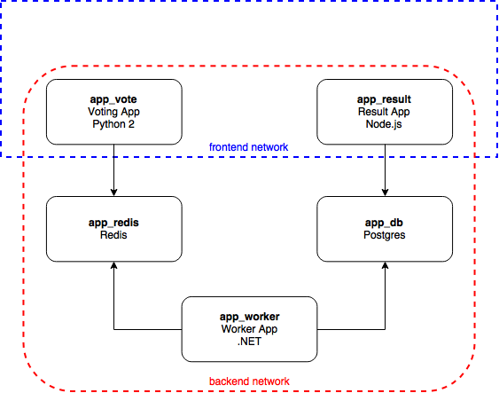

Swarm Mode Demo with Instavote
=========

This is a simple walkthrough for setting up multiple components of an application in a Docker 1.12.1 Swarm cluster with multiple Swarm networks.

The images in this demo have been pushed to this Docker repo: https://hub.docker.com/u/vralex/

Architecture
-----

* A Python webapp which lets you vote between two options
* A Redis queue which collects new votes
* A .NET worker which consumes votes and stores them in…
* A Postgres database backed by a Docker volume
* A Node.js webapp which shows the results of the voting in real time

More details about the components here:
https://github.com/docker/docker-birthday-3/blob/master/tutorial.md#dockercompetition

Getting started in AWS
---------------

These steps apply to all meetup workshop participants:

1. Login to followin AWS console usign the credentials provided:
https://cluj-docker-meetup.signin.aws.amazon.com/console

- Select **Ireland** from top right

2. Navigate to "**Services" > "**Management Tools**" > "**CloudFormation**"

3. Click "**Create Stack**"

4. Choose option "**Specify an Amazon S3 template URL**" and enter this URL:
https://s3-eu-west-1.amazonaws.com/docker-meetup/swarm-cloudformation.tmpl

5. Click **Next**

6. Enter "**Stack name**": user your provided username as stack name
"**Number of additional managers**": 1
"**Number of workers**": 1
"**SSH Key Pair**": docker-meetup

7. Click **Next** until you reach the Review page, then click **Create**

8. Wait 5-10 minutes :) until the stack is created

9. You will find the instances created in EC2 (ask the mentors for help if you need any)

10. The following steps will walk you through setting up the Swarm application, good luck! :)

----------

**Login to one of your Swarm managers via SSH (user: centos)**
You can download the private SSH KEY from here:
https://s3-eu-west-1.amazonaws.com/docker-meetup/docker-meetup.pem

----------

Swarm manual deployment
-----
Create the Swarm **Network** configuration:

	docker network create --driver overlay --subnet 10.0.100.0/24 frontend

	docker network create --driver overlay --subnet 10.0.200.0/24 backend

----------

Create the Swarm **Services**:

	docker service create --name app_db --network backend postgres:9.4

	docker service create --name app_redis --network backend redis:alpine

	docker service create --name app_vote --network frontend,backend --publish 5000:80 vralex/vote

	docker service create --name app_worker --network backend vralex/worker

	docker service create --name app_result --network frontend,backend --publish 5001:80 --publish 5858:5858 vralex/result

The app will be running at [http://YOUR_EC2_IP:5000](http://YOUR_EC2_IP:5000), and the results will be at [http://YOUR_EC2_IP:5001](http://YOUR_EC2_IP:5001).

You can use any of the public IPs from your Swarm cluster.

----

**THE FOLLOWING STEPS ARE OPTIONAL - JUST ANOTHER DEPLOYMENT METHOD**
----

Docker experimental Distributed Application Bundle (DAB) deployment
-----
The docker-compose.yml file from this directory is set up so a bundle can be easily created from it.

Clone this repository on a Swarm manager node:

> curl -O https://github.com/alexvranceanu/docker-meetup-swarm/archive/master.zip

Run in this directory (`cd swarm-example-voting-app`):

	docker-compose pull

    docker-compose bundle

    docker deploy --file swarmexamplevotingapp.dab app

Expose the application ports:

    docker service update --publish-add 5000:80 app_vote

    docker service update --publish-add 5001:80 app_result

The app will be running at [http://YOUR_EC2_IP:5000](http://YOUR_EC2_IP:5000), and the results will be at [http://YOUR_EC2_IP:5001](http://YOUR_EC2_IP:5001).

You can use any of the public IPs from your Swarm cluster.

